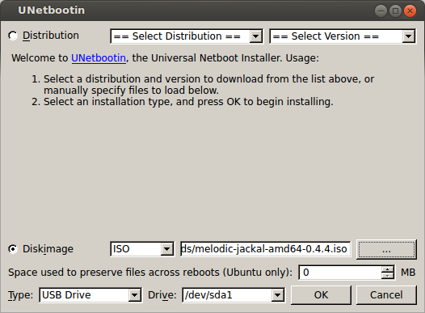

Upgrading your robot's OS
=================================

Once you have backed up your robot's important data you can install the new version of the robot's operating system.
Ubuntu provides a command-line tool for doing an in-place upgrade called ``do-release-upgrade``, but we do not
recommend upgrading this way: doing an in-place upgrade can leave stale configuration files.  We find it is better
to do a fresh install and then restore the backed-up data you made in the previous step.

.. note::

    If your robot uses an Nvidia Jetson as its main PC, skip down to the "Upgrading Jetson" section at the bottom
    of this page

Download the ISO for your robot
---------------------------------

Clearpath Robotics has customized OS installation images for all of our robots available online:
http://packages.clearpathrobotics.com/stable/images/latest/_

Open the link and download the ISO appropriate to your robot.  The ISO will be found in the ``melodic-<your robot>/amd64``
folder.

Write ISO to USB media
---------------------------

After the ISO has finished downloading insert a USB drive of at least 2GB into your computer and use a tool like
``unetbootin`` (on Linux) or ``rufus`` (on Windows) to write the ISO to a USB drive.  This will erase all data already
on the drive, so make sure you've backed up anything important!

Install the OS
-----------------

.. note::

    The following is a general overview of how to reinstall your robot's operating system.  Specific robots may
    require additional steps, such as removing cover plates to access USB/ethernet/HDMI/VGA ports, etc.... Please
    refer to your robot's manual for specific information on how to reinstall the OS on that model of robot.

.. warning::

    While it is highly unlikely, it is possible that the robot's wheels could turn while the OS is installing.
    We recommend placing the robot on blocks and/or engaging the e-stop during the OS installation.

Make sure your robot is powered off and either has freshly-charged batteries installed or is connected to shore power.
Connect a keyboard and monitor to the robot, and make sure it has internet access via an ethernet cable.

Insert the USB drive you set up in the previous step into a USB port on the robot and power the robot on.  Press F7
while the robot is booting to open the boot menu and select the USB drive to boot from.

The installer should run automatically and will power off the robot when it finishes.  Once the robot is powered-off
remove the USB drive and turn the robot back on.  You are now ready to restore your backed-up data.

Upgrading Jetson
-------------------

Clearpath's OS installation ISOs are not suitable for use on the Nvidia Jetson.  If your robot uses a Jetson board
(e.g. the Jetson TX2), you should download the latest version of `Nvidia's SDK Manager <https://developer.nvidia.com/nvidia-sdk-manager>`_
and follow `Nvidia's instructions <https://docs.nvidia.com/sdk-manager/install-with-sdkm-jetson/index.html>`_ to
reinstall the OS on the board.

Once you have reinstalled the OS you can proceed to restoring your backed-up data.
